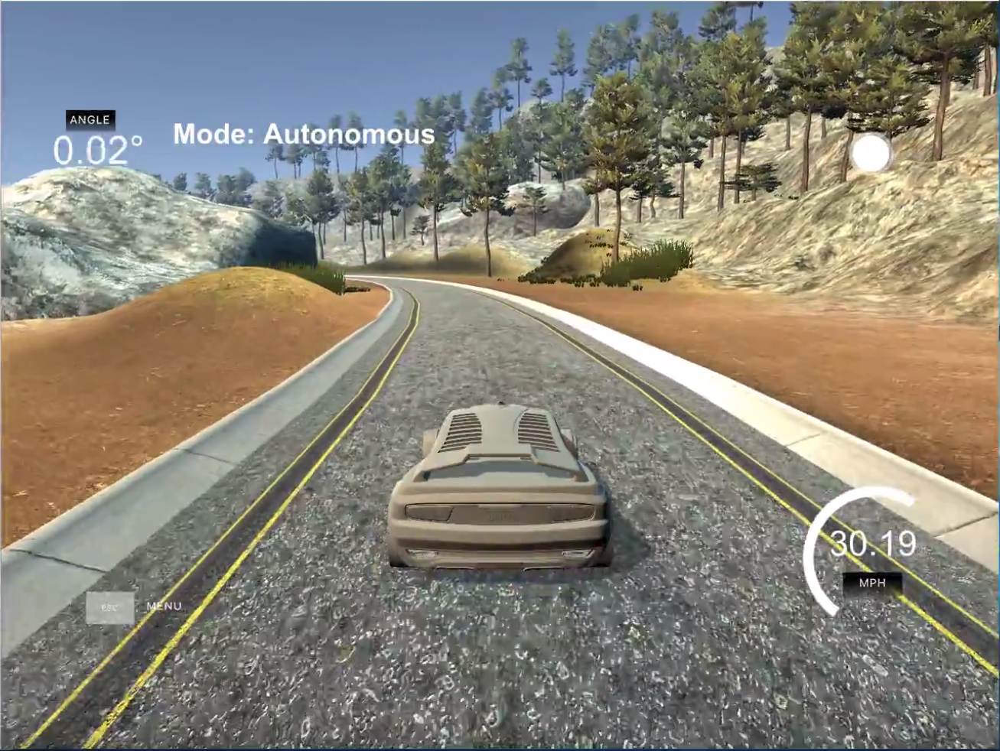
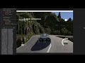

# **Behavioral Cloning** 

**Behavioral Cloning Project**

The goals / steps of this project are the following:
* Use the simulator to collect data of good driving behavior
* Build, a convolution neural network in Keras that predicts steering angles from images
* Train and validate the model with a training and validation set
* Test that the model successfully drives around track one without leaving the road
* Summarize the results with a written report


[//]: # (Image References)

[image1]: ./writeupImages/nVidia_model.png "nVidia model"
[image2]: ./writeupImages/Track1Corner.PNG "Tricky corner in track 1"
[image3]: ./writeupImages/track1_distro_before.png "Raw image data distribution"
[image4]: ./writeupImages/track1_distro_after.png "Raw image data distribution after normalization"
[image5]: ./writeupImages/crop.png "Image crop"
[image6]: ./writeupImages/rand_exposure.png "Random brightness"
[image7]: ./writeupImages/rand_dim.png "Random dim"
[image8]: ./writeupImages/rand_shift.png "Random shift"
[image9]: ./writeupImages/rand_processed.png "Random augmented"
[image10]: ./writeupImages/cv_original.png "CV2 original"
[image11]: ./writeupImages/cv_YUVresized.png "CV2 processed"
[image12]: ./writeupImages/Loss_visualization.png "Loss Visualization"


## Rubric Points
### Here I will consider the [rubric points](https://review.udacity.com/#!/rubrics/432/view) individually and describe how I addressed each point in my implementation.  

---
### Files Submitted & Code Quality

#### 1. Submission includes all required files and can be used to run the simulator in autonomous mode

My project includes the following files:
* `train.py` is the entry point of the program that runs the pipeline for training the neural network
* `Training_Model.py` contains an object for creating and defining the [nVidia model](https://images.nvidia.com/content/tegra/automotive/images/2016/solutions/pdf/end-to-end-dl-using-px.pdf) for this project
* `DataAquisition.py` contains a script to gather all the data address and steering angles of all training data
* `DataProcessing.py` contains a script to preprocess all the input images for the training model
* `drive.py` for driving the car in autonomous mode
* `model.h5` containing a trained convolution neural network 
* `README.md` summarizing the results
* `drive.py` was modified a little bit to accommodate the training model as the nVidia model works better in YUV color space

#### 2. Submission includes functional code
Using the Udacity provided simulator and my drive.py file, the car can be driven autonomously around the track by executing 
```sh
python drive.py model.h5
```

#### 3. Submission code is usable and readable

The `train.py` file contains the code for training and saving the convolution neural network. 
The file shows the pipeline I used for training and validating the model, and it contains comments to explain how the code works.

### Overal Model Description

#### 1. An appropriate model architecture has been employed

The project tutorial suggests to use the [nVidia model](https://images.nvidia.com/content/tegra/automotive/images/2016/solutions/pdf/end-to-end-dl-using-px.pdf)and 
I adopted this model exactly as a starting point, turns out it works quite decently. 

#### 2. Attempts to reduce overfitting in the model

I applied L2 regularization to combat overfitting. Please refer to below sections for complete model description

The model was trained and validated on different data sets to ensure that the model was not overfitting (code line 46-52 in `train.py`). 
The model was tested by running it through the simulator and ensuring that the vehicle could stay on the track.

#### 3. Model parameter tuning

The model used an adam optimizer, so the learning rate was not tuned manually (`Training_Model`.py line 33).

#### 4. Appropriate training data

Training data was chosen to keep the vehicle driving on the road. I used a combination of center lane driving, recovering from the left and right sides of the road ... 

For details about how I created the training data, see the next section. 

### Model Architecture and Training Strategy

#### 1. Solution Design Approach

![alt text][image1]

1. Input: I preprocessed the input images to 66 x 200 x 3 and in YUV color space as suggested by the [paper](https://images.nvidia.com/content/tegra/automotive/images/2016/solutions/pdf/end-to-end-dl-using-px.pdf) 
2. Normalization: I used the `Lambda` function from Keras and scaled the pixel value to x = x/255.0 - 0.5
3. Convolutional Layers: As described in the diagram, first three convolutional layers were implemented using 5x5 filter and 2x2 striding. 
						 I used `RELU` function as activation for all model layers. 
						 Also I applied L2 regularization (value of 0.001) to all model layers to avoid overfitting. 
						 The following two Convo layers have 3x3 filters and 1x1 strides, then subsequently flattened and connected to the rest of fully connected layers
4. Loss function and optimizer: As suggested by the tutorial, I used `MSE` as loss function with adam optimizer

#### 2. Creation of the Training Set & Training Process

I started by recording several runs on track 1 for the training data.
Also, as suggested in the tutorial, I also recorded the vehicle recovering from the sides of the road back to center. 
This way the model would learn to steer back from going out of the track. Without such process, if the wehicle is heading out of the track, 
the model would have no past experience and thus wouldn't know how to handle such situation

After first round of test, I found the vehicle drives quite smoothly when the track is less curvy and the boundary for the track a clear. 
However, the vehicle struggles at sharp turning or particularly at this corner:

![alt text][image2]

Taking a further look in the training class distribution, we found the following discovery

![alt text][image3]

The steering angle range is represented by the x-axis, it appears that based on my training data, the training model is more skew to less or no turn on the smooth track,
thus it does not handle above situation as well as driving straght. Thus, I chopped off all the steering class that have above than average sample class, and the result looks like this:

![alt text][image4]

As a result, the vehicle handles above corner much better. However, it occasionally fails at other scenarios, the track change from going into the bridge,
the part where the track is covered by shadows, just to name a few. Thus, just like what we did in the previous project, I augmented the data by further processed the data set.

Here are some examples:

1. Crop out the image to remove unneccessary pixel information:

![alt text][image5]

2. Applies random brightness adjustment:

![alt text][image6]

3. Randomly dims a side of the image to simulate the shadow:

![alt text][image7]

4. Randomly shift the image up and down to simulate the road bump, this is more for track 2 than track 1:

![alt text][image8]

Also, as suggested in the paper, I preprocessed the image into 66x200x3 dimension with YUV color space before feeding into the training model:

![alt text][image10]
![alt text][image11]

As a result, the vehicle drives much better 

#### 3. Running the pipeline:

I used the model describeed in section 2. I kept the default settings for adam optimizer. 

Instead of using `fit_generator` function from the tutorial, I found it runs miserably slow on my local machine and my desktop is able to handle such large data with just `fit` function, as that is the fit process I chose to use

I separated the collected data into training data and validation data with 9 to 1 split, where the training data was processed through above data agumentation, the validation data was kept intact

I set the epochs to be just 15 because the loss tends to stay stationary after that and sometimes bounces up as sign of overfitting

With above setup, I was able to achieve a validation accuracy of around 9.6%:

![alt text][image12]


#### 4. Model Tuning and Final Result

One thing I have noticed that the result is highly dependable on the training data. Maybe due to the poor optimization of the simulation, 
the program stuts quite severely when I was recording the laps,.As a result, my steering was not very consistent. 
After I noticed the impact of such inconsistency had on my result, I re-run the laps a couple of more times and tried my best combat the jitter.
Such effort yields a more stable bahaviour especially for track 2. 

Also, I replaced the activation function `RELU` with `ELU`. I recalled from the review of my previous project submission, 
the instructor suggests to use `ELU` for better result, and it turned out to be true for this project as well.

Lastly, I found by tuning the learning rate smaller make the vehicle drives smoothier (although there is no improve in validation accuracy)

Here is the final result:

<p align="center"><a href="https://youtu.be/Rnxg7CEsRx0"></a></p> <p align="center"><a href="https://youtu.be/g91YVj5ysgc?t=14s"></a></p> 

Since track 2 has land separation line in the middle which track 1 does not, it is quite hard to let the vehicle drive within its lane. Thus, when I recorded the laps, I simply ignored the lane separation line. 

Overal the result is pretty, occasionally the vehicle would fall off the track for track 2, I believe with extensive image processing and furtuer model modification, it is doable to have the vehicle drive more accurately. However, given the time that I have, I am happy with the result.               

